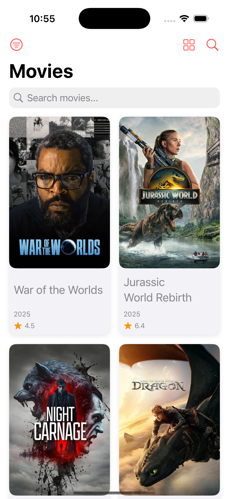
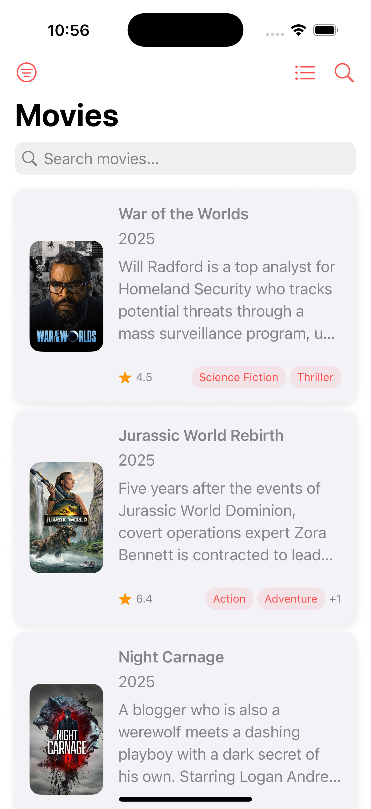
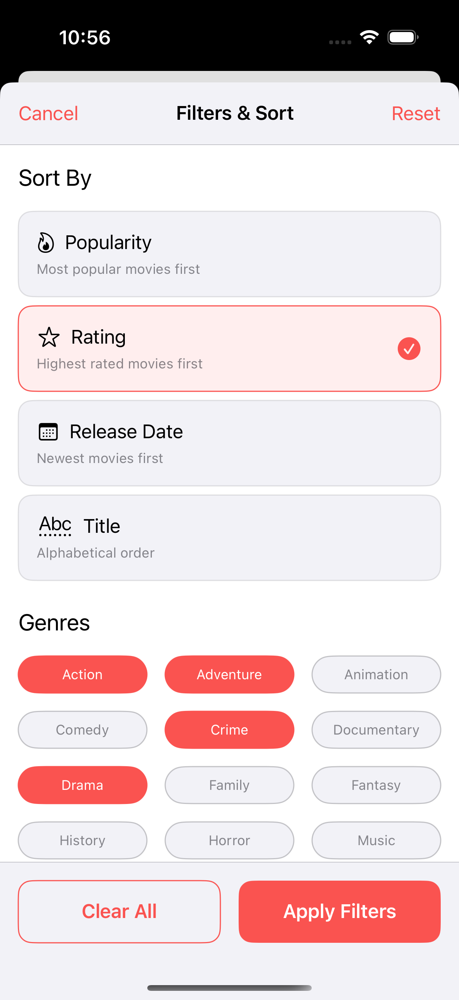
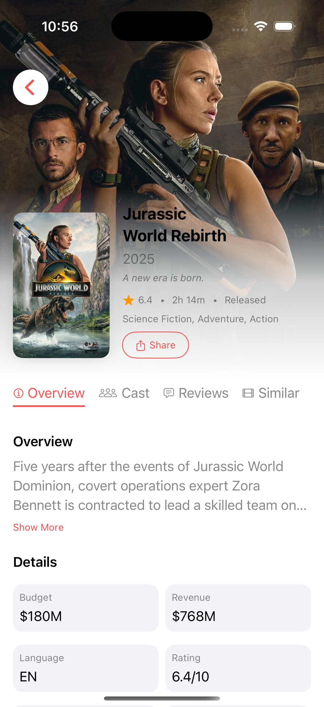

# 🎬 MoviesPlus iOS

[](https://developer.apple.com/ios/)
[](https://swift.org/)
[](https://developer.apple.com/xcode/)

A modern iOS movie discovery app built with SwiftUI and Clean Architecture principles. Discover trending movies, explore detailed information, and enjoy a seamless offline-first experience powered by The Movie Database (TMDB) API.

## ✨ Features

### 🎯 Core Functionality
- **Movie Discovery**: Browse trending and popular movies
- **Movie Search**: Search movies by title
- **Detailed Information**: Comprehensive movie details including overview, ratings, budget, revenue, and production company info
- **Smart Filtering**: Filter movies by genre
- **Flexible Sorting**: Sort by popularity, rating, release date, or alphabetical order
- **View Modes**: Switch between grid and list layouts for optimal browsing experience

### 🔧 Technical Features
- **Offline-First Architecture**: Seamless experience with automatic data caching using SwiftData
- **Modular Design**: Clean separation of concerns across independent framework modules
- **Reactive Programming**: Built with Combine framework for responsive UI updates
- **Modern UI**: Native SwiftUI implementation with custom theming system
- **Comprehensive Testing**: Unit tests for view models, use cases, and data sources

## 📱 Screenshots

<table>
<tr>
<td align="center">
  <br/>
  <b>Movies Grid View</b><br/>
</td>
<td align="center">
  <br/>
  <b>Movies List View</b><br/>
</td>
<td align="center">
  <br/>
  <b>Sort & Filter</b><br/>
</td>
<td align="center">
  <br/>
  <b>Movie Details</b><br/>
</td>
</tr>
</table>

## 🏗️ Architecture

MoviesPlus follows **Clean Architecture** principles with a modular workspace design:

```
📦 MoviesPlus_iOS (Xcode Workspace)
├── 🎯 MoviesApp/              # Main iOS app target
├── 🔧 MPCore/                 # Shared core framework
└── 📁 Features/
    ├── 📋 MPMoviesListing/    # Movie listing feature module
    └── 📖 MPMovieDetails/     # Movie details feature module
```

Each module is an independent Xcode framework project with its own:
- Source code and resources
- Unit test target
- Independent build configuration

### 🎨 Architecture Layers (per Feature Module)

#### Domain Layer
- **Entities**: Core business models (`Movie`, `MovieDetails`, `Genre`)
- **Use Cases**: Business logic (`GetMoviesUseCase`, `SearchMoviesUseCase`, `FilterAndSortMoviesUseCase`)
- **Repository Protocols**: Data access contracts

#### Data Layer
- **Repository Implementations**: Concrete data access with offline-first strategy
- **Data Sources**: Remote (TMDB API) and Local (SwiftData) data sources
- **Models**: API response models and local storage models

#### Presentation Layer
- **Views**: SwiftUI views with reactive UI updates
- **ViewModels**: MVVM pattern with Combine publishers
- **Coordinators**: Navigation and inter-module communication

### 🔑 Key Patterns & Principles
- **Modular Architecture**: Independent, reusable framework modules
- **MVVM + Coordinators**: Clear separation of UI, business logic, and navigation
- **Repository Pattern**: Unified data access layer with caching strategy
- **Reactive Programming**: Combine-based state management and data flow
- **Dependency Injection**: Constructor injection for testable, decoupled code

## 🚀 Getting Started

### 📋 Prerequisites
- **Xcode 16.4+**
- **iOS 18.5+** deployment target
- **Swift 5.0+**
- **TMDB API Key** (free registration at [TMDB](https://www.themoviedb.org/))

### ⚡ Quick Setup

1. **Clone the repository**
   ```bash
   git clone https://github.com/yourusername/MoviesPlus_iOS.git
   cd MoviesPlus_iOS
   ```

2. **Open the workspace**
   ```bash
   open MoviesPlus.xcworkspace
   ```
   
3. **Configure API Key**
   - Get your free API key from [TMDB](https://www.themoviedb.org/settings/api)
   - Update the API key in `MPCore/MPCore/Utilities/Constants.swift`:
   ```swift
   public static let apiKey = "YOUR_TMDB_API_KEY_HERE"
   ```

4. **Build and Run**
   - Select the `MoviesApp` scheme
   - Choose your target device/simulator
   - Press `Cmd + R` to build and run

## 🧪 Testing

The project includes comprehensive test coverage across all modules:

### Test Structure
Each framework module has its own dedicated test target:
- **MPCoreTests**: BaseViewModel, networking, and data persistence
- **MPMoviesListingTests**: Movie listing feature tests
- **MPMovieDetailsTests**: Movie details feature tests  

### Running Tests
```bash
# Run all tests for the entire workspace
⌘ + U in Xcode (with any scheme selected)

# Run tests for specific modules:
# Select the framework scheme in Xcode and press ⌘ + U
```

### Test Coverage
- **Unit Tests**: ViewModels, Use Cases, and business logic
- **Integration Tests**: Local data sources with SwiftData
- **Error Handling**: Network failures, data corruption, and edge cases

## 🛠️ Technologies & Frameworks

### Core Technologies
- **SwiftUI**: Modern declarative UI framework for building native iOS interfaces
- **Combine**: Reactive programming framework for handling asynchronous operations
- **SwiftData**: Apple's modern data persistence framework for local caching
- **Swift 5.0**: Latest Swift language features and performance improvements

### Networking & Data
- **Moya**: Type-safe network abstraction layer built on Alamofire
- **SDWebImage**: Asynchronous image downloading and caching
- **The Movie Database (TMDB) API**: Movie data source with comprehensive metadata

### Architecture & Design Patterns
- **Clean Architecture**: Separation of concerns with clear layer boundaries
- **MVVM Pattern**: Reactive view models with Combine publishers
- **Coordinator Pattern**: Centralized navigation and flow control
- **Repository Pattern**: Unified data access with offline-first strategy
- **Observer Pattern**: Reactive state management and UI updates

### Development & Testing
- **Xcode Workspace**: Multi-target modular architecture
- **XCTest**: Unit and integration testing framework
- **SwiftUI Previews**: Real-time UI development and testing
- **Dependency Injection**: Constructor-based DI for testable code

## 📁 Project Structure

```
MoviesPlus_iOS/ (Xcode Workspace)
│
├── 📱 MoviesApp/                    # Main iOS Application Target
│   ├── MoviesAppApp.swift           # SwiftUI App entry point
│   ├── Coordinators/                # App-level navigation coordinators
│   │   ├── AppCoordinator.swift     # Root coordinator
│   │   └── AppCoordinatorView.swift # Coordinator view wrapper
│   ├── Assets.xcassets/             # App icons and assets
│   └── MoviesAppTests/              # Main app tests
│
├── 🔧 MPCore/ (Framework)           # Shared Core Framework
│   ├── Components/                  # Reusable UI components
│   │   └── Images/                  # Image loading components
│   ├── Styling/                     # Centralized theme system
│   │   ├── Theme.swift              # Main theme provider
│   │   ├── ThemeColors.swift        # Color palette
│   │   ├── ThemeTypography.swift    # Typography system
│   │   └── ThemeSpacing.swift       # Spacing constants
│   ├── Networking/                  # Network layer
│   │   ├── NetworkManager.swift     # Moya-based network manager
│   │   └── NetworkError.swift       # Error handling
│   ├── DataSources/                 # API definitions
│   │   └── TMDBAPI.swift           # TMDB service definitions
│   ├── Persistence/                 # Data persistence
│   │   └── SwiftDataStack.swift    # SwiftData configuration
│   ├── Navigation/                  # Coordinator protocols
│   ├── ViewModels/                  # Base view model & View model state
│   └── MPCoreTests/                 # Core framework tests
│
└── 📁 Features/                     # Feature Modules
    │
    ├── 📋 MPMoviesListing/ (Framework)  # Movies List Feature
    │   ├── Domain/                      # Business Logic Layer
    │   │   ├── Entities/                # Core business models
    │   │   ├── UseCases/               # Business use cases
    │   │   └── Repository/             # Repository protocols
    │   ├── Data/                       # Data Access Layer
    │   │   ├── Repository/             # Repository implementations
    │   │   ├── DataSources/            # Remote & Local data sources
    │   │   └── Models/                 # API & storage models
    │   ├── Presentation/               # UI Layer
    │   │   ├── Views/                  # SwiftUI views
    │   │   ├── ViewModels/             # View models
    │   │   └── Coordinators/           # Feature coordinators
    │   └── MPMoviesListingTests/       # Feature tests
    │
    └── 📖 MPMovieDetails/ (Framework)   # Movie Details Feature
        ├── Domain/                      # Business Logic Layer
        │   ├── Entities/                # Core business models
        │   ├── UseCases/               # Business use cases
        │   └── Repository/             # Repository protocols
        ├── Data/                       # Data Access Layer
        │   ├── Repository/             # Repository implementations
        │   ├── DataSources/            # Remote & Local data sources
        │   └── Models/                 # API & storage models
        ├── Presentation/               # UI Layer
        │   ├── Views/                  # SwiftUI views
        │   ├── ViewModels/             # View models
        │   └── Coordinators/           # Feature coordinators
        └── MPMovieDetailsTests/        # Feature tests
```

## 🔧 Development Guidelines

### Architecture Principles
- **Clean Architecture**: Maintain clear separation between Domain, Data, and Presentation layers
- **Single Responsibility**: Each class/struct should have one reason to change
- **Dependency Inversion**: High-level modules should not depend on low-level modules
- **Interface Segregation**: Use focused protocols rather than large interfaces

### Code Quality
- **Testability**: Write testable code with dependency injection
- **Error Handling**: Proper error propagation
- **Documentation**: Document public APIs and complex business logic

### Modular Development
- **Feature Independence**: Features should be self-contained and reusable
- **Core Abstractions**: Keep MPCore focused on shared utilities and protocols
- **Minimal Dependencies**: Avoid circular dependencies between modules

## 🚀 Future Enhancements

### Planned Features
- **User Favorites**: Local persistence of favorite movies
- **Movie Cast**: Cast information
- **Movie Review**: Users reviews
- **Similar Movie**: Same genre movie recommendations

### Technical Improvements
- **Error Handling**: Enhanced and comprehensive error propagation and handling
- **Accessibility**: VoiceOver and dynamic type support
- **Localization**: Multi-language support

## 🙏 Acknowledgments

- **The Movie Database (TMDB)**: For providing the comprehensive movie database API
- **Swift Community**: For excellent open-source frameworks and development tools
- **Clean Architecture**: Robert C. Martin's architectural principles and best practices
- **Apple**: For SwiftUI, Combine, SwiftData, and the iOS development ecosystem

## 📞 Support & Contributing

### Getting Help
- 🐛 **Bug Reports**: [Open an issue](https://github.com/mahmoudOmara/MoviesPlus_iOS/issues)
- 📧 **Contact**: mahmoud.omara909@gmail.com

---

⭐ **Star this repository** if you find it helpful for learning iOS development with Clean Architecture! 
